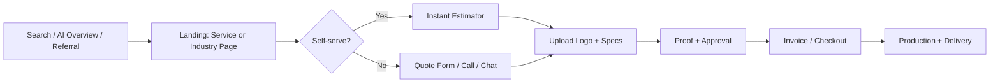
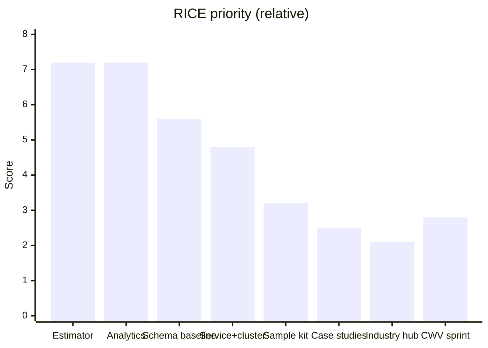

# AI-Agent Build Guide: US B2B Custom Apparel Decoration Website (Screen Printing, Embroidery, DTF, DTG, Promotional Items)

## Executive summary

This document is a **ready-to-use instruction set** for building a B2B custom apparel decoration website that maximizes **SEO performance, AI-shaped search visibility, and conversion rate** in the US market.

Key strategic premise: **AI-driven search does not require “special SEO.”** Google’s documentation states that the same foundational SEO best practices apply for AI features (AI Overviews, AI Mode), with *no additional requirements or special schema needed*, and highlights a “query fan-out” approach (multiple subtopic searches) that increases the importance of **clear site structure, internal linking, and comprehensive coverage of buyer sub-questions**. citeturn12view0turn19view9

B2B buying behavior research supports a second premise: most buyers prefer **digital self-service** and can be actively frustrated by misaligned or inconsistent seller messaging. citeturn17view2 Therefore, the website must behave like a modern self-serve buying experience: price clarity, turnaround clarity, proofing process transparency, samples where possible, and frictionless quote capture—while still enabling consultative support for complex orders.

A third premise: promotional item programs can be a powerful B2B growth lever when framed as “kits” (onboarding, safety, trade show) rather than catalogs. PPAI research reports high downstream action after receiving promo items (e.g., looking up the brand, purchasing), and ASI’s Ad Impressions research emphasizes strong ROI characteristics and category influence of logoed items. citeturn15view0turn17view0turn15view1

## How to use this Markdown as an AI-agent prompt

Use this file as the **single source of truth** for a site-building agent. The agent should execute work in phases and always output artifacts that can be implemented (IA diagrams, page templates, copy drafts, schema blocks, tracking plans).

**Operating constraints (agent rules):**
- Prioritize Google Search documentation for SEO/AI Search requirements; treat everything else as secondary. citeturn12view0turn21view8
- Avoid “scaled content abuse.” Do not mass-generate near-duplicate pages (especially location/variant pages) without clear user value. citeturn21view7turn21view6
- Every core page must reduce buyer uncertainty: pricing drivers, minimums, turnaround tiers, artwork requirements, proofing steps, and reorder process.
- Make navigation crawlable and intentionally link core hubs and clusters. citeturn22view1turn22view2
- Structured data is for eligibility/clarity, not guaranteed rich results; markup must match visible content. citeturn21view8turn22view2

**Primary deliverables the agent should produce (in order):**
- Site architecture (mermaid) + URL taxonomy.
- Core page templates (Home, Services, each service page, Industries, Portfolio/Case Studies, Pricing/Instant Quote, FAQs, Resources, Blog).
- Keyword theme map by service (short-tail and long-tail; transactional vs informational intent).
- AI-SEO implementation pack (schema inventory + JSON-LD templates + internal linking strategy + entity checklist + LLM prompt templates).
- Technical SEO and on-page QA checklist.
- Conversion system (CTAs, lead magnets, quote flow, trust system).
- Analytics + experimentation plan (GA4 + Search Console + heatmaps + A/B tests).
- Prioritized roadmap (RICE scoring) and implementation plan.

## Competitive audit framework and benchmark competitors

### Competitive audit framework

Google states that its systems infer structure through **relationships between pages based on linkages**, not URL structure alone, and that internal link architecture is crucial for indexing and navigation. citeturn22view2turn22view1 Competitive auditing in this niche must therefore evaluate both **SERP performance** and **site structure + conversion mechanics**.

Use this rubric to score each competitor and your site (0–3 per line; total out of 100). Re-run quarterly.

| Audit category | What to measure | How to measure quickly | Why it matters |
|---|---|---|---|
| SERP footprint by intent | Rankings and snippets for transactional vs informational queries | Track 30–50 queries per service and per top industry | Directly determines lead volume and “AI fan-out” capture citeturn12view0 |
| Information architecture | Service hubs, industry hubs, resources, internal linking density | Click depth; orphan pages; hub-to-spoke linking | Affects crawlability and sitelinks behavior citeturn22view0turn22view1 |
| Pricing and process clarity | Do they explain pricing drivers and process steps? | Can you estimate cost/timeline without contacting sales? | Supports rep-free buyer preference citeturn17view2 |
| Decision tools | Calculators, designers, samples, stores/group ordering | Identify self-serve tools and where they appear | Self-serve reduces friction and increases conversions |
| Trust system | Guarantees, reviews, proof policies, case studies | Count trust elements near CTAs and forms | Reduces perceived risk; supports higher lead quality |
| Technical SEO hygiene | CWV, mobile parity, structured data validity, indexability | Lighthouse + Search Console reports + Rich Results Test | Core Web Vitals are used by ranking systems, but not sufficient alone citeturn22view7turn22view8 |

### Top competitor benchmark set

The table below is a **benchmark set** across apparel printing, embroidery/catalog models, promo, and DTF/transfer ecosystems—chosen because they represent high-expectation user experiences and recurring SERP visibility patterns in this category.

| Competitor | Primary positioning pattern | Evidence of conversion mechanics to learn from |
|---|---|---|
| **entity["company","Custom Ink","custom apparel printer"]** | All-inclusive pricing + support + group ordering | Transparent pricing drivers (product, colors, quantity) and “no hidden fees” messaging; routes users into quotes and group ordering. citeturn19view0turn20view0 |
| **entity["company","RushOrderTees","custom t-shirt printer"]** | Speed + calculators + broad apparel | Quote calculators surfaced on product pages and cost explained via product/quantity/customization. citeturn19view1 |
| **entity["company","Queensboro","logo apparel and promo catalog"]** | Catalog breadth + logo management + store programs | Navigation emphasizes “Create a Store” and logo upload/management, supporting ongoing programs. citeturn19view2 |
| **entity["company","BlueCotton","custom t-shirt printer"]** | Delivery guarantees + urgency offers | “Shirts in a day” guarantee framing for urgency buyers. citeturn19view3 |
| **entity["company","ooShirts","discount custom t-shirt printer"]** | Low price guarantees + instant pricing + samples | $0.99 blank sample offer and instant quote/price visibility on SKU page. citeturn19view5turn20view2 |
| **entity["company","LogoUp","custom logo apparel retailer"]** | Corporate apparel catalog + promo add-ons | Heavy category structure spanning apparel + promotional products, designed for browsing. citeturn20view3 |
| **entity["company","4imprint","promotional products retailer"]** | Promo depth + risk removal via sampling | Explicit “try before you buy” free samples for internal stakeholder buy-in. citeturn19view4turn2search10 |
| **entity["company","Printful","print-on-demand platform"]** | DTG explanation + no minimum positioning | Defines DTG and emphasizes suitability for complex multicolor designs; no-min model. citeturn19view8 |
| **entity["company","Ninja Transfers","dtf transfer supplier"]** | DTF transfers speed + minimal friction | Clear “no setup/art fees/minimums” positioning and fast shipping emphasis. citeturn19view6turn3search2 |
| **entity["company","Transfer Express","heat transfer supplier"]** | Tools + breadth of transfer types + samples | Emphasizes DTF + screen printed transfers and “use our art or upload your own.” citeturn19view7turn3search1turn3search9 |

### Competitive feature comparison table

Use this to identify **conversion features you must match** and **differentiators you can exceed**.

| Feature | Why it matters | “Must match” baseline | “Outperform” target |
|---|---|---|---|
| Instant budget confidence | Buyers want to self-serve and decide earlier | Basic estimator + ranges | Interactive estimator + “what changes price” + downloadable estimate PDF |
| Samples | De-risks quality and stakeholder alignment | Some sampling path (free or paid) | Sample kit + “credit toward order” + comparison pack by method (DTF vs DTG vs screen vs embroidery) citeturn19view4turn19view5 |
| Guaranteed turnaround tiers | Converts urgency traffic | Clear standard vs rush tiers | Guaranteed-by calendar + rush gating by product/complexity (only if operationally true) citeturn19view3 |
| Store / program capability | Retains B2B uniforms and ongoing merch | Manual reorder support | Program landing + “company store” workflow and governance options citeturn19view2 |
| Proofing clarity | Prevents disputes and increases trust | “We send proofs” | SLA for proof delivery + revision policy + approval gates |
| Trust system | Increases conversion rate and lead quality | Reviews + basic portfolio | Outcomes-based case studies + customer logos + process standards |

## Site structure, essential pages, and page templates

### Site architecture model

Google explicitly notes that navigation structures and interlinking impact how it understands site structure; ensure every key page is reachable via links. citeturn22view2turn22view1

```mermaid
flowchart TD
  Home[Home]
  Home --> ServicesHub[Services Hub]
  Home --> IndustriesHub[Industries Hub]
  Home --> ProductsHub[Popular Products Hub]
  Home --> Pricing[Pricing + Instant Estimate]
  Home --> Portfolio[Portfolio + Case Studies]
  Home --> Resources[Resources Hub]
  Home --> FAQ[FAQ Center]
  Home --> About[About + Capabilities]
  Home --> Contact[Contact + Quote]

  ServicesHub --> SP[Screen Printing]
  ServicesHub --> EMB[Embroidery]
  ServicesHub --> DTF[DTF Printing]
  ServicesHub --> DTG[DTG Printing]
  ServicesHub --> PROMO[Promotional Items]

  IndustriesHub --> IND1[Construction + Trades]
  IndustriesHub --> IND2[Healthcare]
  IndustriesHub --> IND3[Hospitality]
  IndustriesHub --> IND4[Schools + Education]
  IndustriesHub --> IND5[Nonprofits]
  IndustriesHub --> IND6[Corporate + HR]

  Resources --> R1[Artwork + File Guidelines]
  Resources --> R2[Method Selector Tool]
  Resources --> R3[Turnaround + Shipping Guide]
  Resources --> R4[Logo Placement + Sizing Guide]
  Resources --> R5[Care + Durability Guide]
  Resources --> R6[Blog + Guides]

  ProductsHub --> P1[Custom T-Shirts]
  ProductsHub --> P2[Polos]
  ProductsHub --> P3[Hoodies]
  ProductsHub --> P4[Hats]
  ProductsHub --> P5[Workwear + Hi-Vis]
  ProductsHub --> P6[Bags + Drinkware]
```



### URL taxonomy and navigation rules

- Use a clean, descriptive URL system; Google recommends hyphens over underscores. citeturn22view3  
- Do not rely on URL structure alone to signal hierarchy; Google’s systems rely heavily on internal links and navigation. citeturn22view2  
- Primary pattern (CMS-agnostic):
  - `/services/screen-printing/`, `/services/embroidery/`, `/services/dtf-printing/`, `/services/dtg-printing/`, `/services/promotional-items/`
  - `/industries/construction/` (repeat for each)
  - `/products/t-shirts/`, `/products/polos/` (category pages; SKU pages optional if you sell specific blanks)
  - `/pricing/`, `/portfolio/`, `/case-studies/<slug>/`, `/resources/`, `/faqs/`

### Essential pages and required content blocks

Page blocks below are designed to satisfy both **transactional conversion needs** and **AI fan-out informational sub-questions**, which Google explicitly describes for AI Overviews/AI Mode. citeturn12view0turn19view9

| Page | Primary goal | Above-the-fold blocks | Middle blocks (conversion-critical) | Bottom blocks |
|---|---|---|---|---|
| Home | Route by intent and convert | Service selector + “Get estimate” CTA + turnaround headline | Trust stack + “how it works” + featured industries | Portfolio preview + FAQs + lead magnets |
| Services hub | Service discovery | Cards for each service with “best for” | Method comparison teaser + links to guides | FAQ + case studies |
| Service page | Win service-intent traffic | Outcome headline + audience + price-factor summary + estimate CTA | Best use cases, limitations, process, artwork requirements, turnaround tiers | Case studies + FAQs + internal links to products/industries |
| Industries page | Capture vertical intent | Industry pain points + recommended solutions | Suggested products + decoration method guidance | Proof/case studies + reorder/program CTA |
| Pricing + instant estimate | Reduce uncertainty | Estimator + transparent assumptions | Price drivers + examples | FAQ + next-step CTAs |
| Portfolio / case studies | Proof and differentiation | Filterable gallery | Case study template pages | Process + QA/delivery standards |
| FAQ center | Reduce objections + win PAA/AI | Categorized FAQs | Expandable answer-first sections | CTA to quote + related resources |
| Resources hub | Capture informational demand | “Most requested guides” | Tools (method selector, file checker) | Email capture lead magnets |

### Page template table (copy + SEO + UX requirements)

| Template type | H1 formula | Suggested H2 structure | Primary CTA | Schema targets |
|---|---|---|---|---|
| Service page | “Custom [Service] for Businesses” | Use cases → Pricing drivers → Process → Artwork → Turnaround → FAQs | “Get instant estimate” | Organization, LocalBusiness (if applicable), Service, FAQPage, BreadcrumbList citeturn21view1turn21view2turn13search0turn21view4turn8search0 |
| Industry page | “[Industry] Uniforms & Branded Gear” | Pain points → Recommended products → Methods → Compliance notes → FAQs | “Build an [industry] kit” | Service, FAQPage, BreadcrumbList |
| Product category | “Custom [Product]” | Best sellers → Decoration methods → Logo placement → Pricing factors → FAQs | “Price this item” | Product/Offer (if applicable), BreadcrumbList citeturn21view3turn13search2 |
| Case study | “[Customer type] + [solution]” | Challenge → Solution → Specs → Proofing → Results → Reorderability | “Replicate this project” | (Optional) Organization + CreativeWork patterns; BreadcrumbList |
| Pricing | “Instant Estimate for Custom [Category]” | Estimator → Price drivers → Examples → FAQs | “Request formal quote” | FAQPage, BreadcrumbList |

## Keyword themes, intent mapping, and content production plan

### Keyword strategy principles

- Build for **two intent layers**:
  - Transactional (“buy/quote/order/near me/bulk/rush”) → service/product/industry landing pages.
  - Informational (“cost/how long/best method/file requirements/durability”) → resources + FAQs + comparison guides.  
- Design content so it can be pulled into AI Overviews and AI Mode, which Google states use query fan-out across subtopics. citeturn12view0turn19view9

### Keyword themes by service

Use these as your build list; refine with Search Console once live (AI feature traffic is included in overall Search Console web reporting). citeturn12view0turn11search1

| Service | Short-tail transactional themes | Long-tail transactional (high conversion) | Informational cluster themes |
|---|---|---|---|
| Screen printing | custom screen printing; bulk t-shirt printing | screen printing quote for [qty]; screen printing turnaround; screen print vs dtg cost; best shirts for screen printing | screen printing price drivers; ink types; color count impact; wash durability |
| Embroidery | custom embroidery; embroidered polos; embroidered hats | embroidered polos for employees; digitizing fee explained; left chest embroidery pricing; embroidered work shirts | stitch count explained; embroidery vs printing; logo simplification limitations |
| DTF | dtf printing; dtf transfers; dtf gang sheet | dtf gang sheet pricing; dtf for polyester; dtf vs dtg vs screen; dtf turnaround | what is dtf; durability; artwork prep; (if transfers) press settings |
| DTG | dtg printing; direct-to-garment printing | dtg small runs; dtg no minimum; dtg vs screen printing breakpoints | what is dtg; best fabrics; color profiles; file setup guidance |
| Promotional items | custom promotional products; company swag | trade show swag kits; onboarding kits; rush promo items; corporate gifts with logo | promo ideas by industry; swag budget planning; kitting and shipping guidance |

### Content cluster map (hub-and-spoke)

Google recommends people-first content and warns against search-engine-first production. citeturn9search0turn21view7turn21view6 Content needs to be both **helpful** and **conversion-supporting**.

| Cluster | Pages to publish first | Why these first |
|---|---|---|
| Pricing clarity | “What affects pricing for [service]?” for each service + estimator page | Reduces the biggest friction (uncertainty) and supports rep-free buying preference citeturn17view2 |
| Method selection | “Screen vs DTG vs DTF”; “Embroidery vs print”; “Best method by fabric” | Captures investigation queries and routes to service pages |
| Operational confidence | Artwork/file checklist; proofing process; turnaround tiers; reorder process | Improves lead quality and reduces back-and-forth |
| Industry kits | Construction; healthcare; hospitality; education; nonprofit; corporate | Vertical intent pages convert strongly for uniform programs |

### Cadence and production plan (small-team realistic)

Recommended baseline:
- **Two guides per month** (pricing/method/operations)
- **One case study per month**
- **One refresh per month** (update top pages based on Search Console queries and conversion data)

**Content formats:**
- Guides (800–2,000 words) with checklists and visuals
- Comparison pages with decision tables
- Downloadable lead magnets (PDF/Sheets templates)
- Case studies with specs and outcomes
- Tool pages (method selector, estimator, file checker)

**Reusable content template (for every guide):**
- Answer-first summary (80–120 words)
- “When to use / When not to use”
- Pricing inputs (not fake prices)
- Turnaround inputs
- Artwork requirements
- Common mistakes
- CTA to estimate/quote + related service links

## AI-SEO tactics: schema, entities, semantic structure, and LLM generation workflows

### AI search requirements (what matters and what doesn’t)

Google states:
- No special optimizations are required for AI Overviews/AI Mode beyond foundational SEO. citeturn12view0turn19view9
- AI Overviews/AI Mode may use **query fan-out** across subtopics and data sources. citeturn12view0turn19view9
- AI feature traffic is included in Search Console performance reporting (“Web” search type). citeturn12view0turn11search1

Implication: “AI SEO” is mostly **structured clarity + complete topical coverage + strong internal linking**, not gimmicks.

### Schema inventory (what to implement)

Structured data enables eligibility but does not guarantee appearance, and must match visible content. citeturn21view8turn22view2

**Schema types to prioritize (by page type):**
- Home/sitewide: Organization, WebSite (identity and disambiguation) citeturn21view1turn13search3turn13search7
- Location/contact (if you have a public-facing location): LocalBusiness citeturn21view2turn8search16
- Service pages: Service (+ provider link to Organization/LocalBusiness) citeturn13search0turn13search11
- Product category/SKU pages (if you present offers): Product + Offer (merchant listing eligibility, when applicable) citeturn21view3turn13search2turn13search1
- FAQ center and service FAQs: FAQPage citeturn21view4turn8search2
- Breadcrumb UI: BreadcrumbList citeturn8search0turn8search6
- Reviews: Use review snippet markup only where eligible; avoid “self-serving reviews” misuse. citeturn21view5turn8search5

**Validation workflow:**
- Rich Results Test + fix critical errors citeturn21view2turn21view4  
- Schema Markup Validator for general schema checks citeturn8search7turn8search3  
- Re-check after template launches and after CMS/theme updates.

### Entity optimization and semantic NLP (practical implementation)

Treat the site as a “decision graph”:
- **Entity definition:** Your business identity (Organization/LocalBusiness) should be consistently defined and disambiguated; Google notes Organization markup can help it understand and disambiguate organizations. citeturn21view1  
- **Internal linking:** Create intentional hub-to-spoke systems; Google emphasizes link architecture for indexing and also notes sitelinks are inferred by analyzing site link structure. citeturn22view1turn22view0turn22view2  
- **Answer-first formatting:** Use concise definitions, then expand. This supports classic snippets and AI-driven extraction patterns. citeturn12view0turn22view5  
- **Buyer-language coverage:** Each service page must explicitly cover:
  - Best use cases and limitations
  - Pricing inputs (what changes cost)
  - Turnaround tiers
  - Artwork requirements
  - Proofing/approval steps
  - Reorder process

### LLM content generation best practices (safe, compliant, effective)

Google allows AI-assisted content, but warns that generating many pages without adding user value can violate scaled content abuse policies. citeturn21view6turn21view7

OpenAI’s prompt engineering guidance emphasizes clear instructions, specificity, and structured prompting. citeturn10search3turn10search7

**Recommended production workflow (human-in-the-loop):**
- Inputs: your real production constraints (minimums, turnarounds, proofing SLA, what you will not do)
- Output: LLM-generated draft
- Human step: accuracy pass + differentiation pass + add original examples/photos/tools
- QA: “Does this page exist to help a buyer?” test (people-first) citeturn9search0

**Reusable prompt templates (copy/paste)**

```text
ROLE
You are a B2B SEO + conversion copywriter for a US custom apparel decoration company.

TASK
Create a service landing page for: [SERVICE] (screen printing / embroidery / DTF / DTG / promotional items).
Audience: US B2B buyers (ops/HR/marketing) buying uniforms, events, onboarding kits, trade show swag.
Goal: maximize qualified quote requests and sample-kit requests while setting accurate expectations.

STYLE
Concise, practical, confident. No hype. No unverifiable superlatives.

REQUIREMENTS
- First 120 words: define the service, best-fit use cases, and common constraints.
- Include sections:
  1) Best For / Not Ideal For
  2) Pricing Drivers (no fake prices; explain variables)
  3) Turnaround Tiers (standard/rush; what affects timing)
  4) Artwork + File Requirements
  5) Proofing + Approval Process (SLA + revisions policy)
  6) Product Recommendations (t-shirts/polos/hats/workwear etc)
  7) FAQs (8–12 real buyer questions)
  8) Next Steps (CTA)
- Provide:
  - Suggested Title Tag (60–65 chars)
  - Meta Description (145–160 chars)
  - H1 and H2/H3 outline
  - Internal links to these pages: [LIST TARGET URLS]

CONTEXT (must not contradict)
"""
[Your actual operational details]
"""
```

```text
ROLE
You are a technical SEO engineer.

TASK
Given page type [SERVICE PAGE / PRICING PAGE / FAQ PAGE / PRODUCT CATEGORY],
produce JSON-LD schema recommendations using only Google-supported formats and ensure markup matches visible content.

OUTPUT
- Schema types to use
- Required properties checklist
- JSON-LD templates with placeholders
- Validation steps (Rich Results Test + Schema Markup Validator)
```

## On-page and technical SEO checklist (implementation-ready)

### Crawlability, site structure, and indexing controls

- Ensure important pages are reachable through crawlable links and navigation; internal link architecture is critical for discovery and indexing. citeturn22view1turn22view2  
- Build sitemaps and follow size limits; split into multiple sitemaps and use sitemap index if needed. citeturn21view0  
- Use indexing controls correctly:
  - Use noindex to block indexing (do not rely solely on robots.txt for removal behavior). citeturn5search2turn5search6  
- Don’t waste time on meta keywords; Google ignores the keywords meta tag for ranking. citeturn22view6  

### Snippets, titles, and meta

- Title links: write descriptive and concise `<title>` elements; Google may rewrite titles, but best practices still apply. citeturn22view4  
- Meta descriptions: treat as ad copy; Google may use them for snippets when relevant. citeturn22view5turn18search1  
- If you need snippet controls: use nosnippet, max-snippet, data-nosnippet; these are documented controls. citeturn18search1turn18search3  

### Core Web Vitals, mobile parity, and performance

- Core Web Vitals are used by Google’s ranking systems, but passing CWV is not sufficient alone. citeturn22view7turn22view8  
- Target thresholds:
  - LCP < 2.5s, INP < 200ms, CLS < 0.1 citeturn22view8turn6search1  
- Mobile-first indexing: ensure content parity and functionality parity between mobile and desktop. citeturn5search3  

### Structured data QA requirements

- Implement JSON-LD and ensure markup aligns with visible main content; Google does not guarantee rich result appearance. citeturn21view8turn8search7  
- Organization markup can help disambiguate organizations; LocalBusiness can communicate hours/departments; merchant listing/Product/Offer supports product experiences where applicable. citeturn21view1turn21view2turn21view3  

## Conversion system: CTAs, lead magnets, funnels, and analytics

### High-converting CTAs for US B2B buyers

These CTAs are designed to support **rep-free self-service** demand while offering “escape hatches” for complex needs. citeturn17view2

| CTA | Where to place | What it should do |
|---|---|---|
| Get instant estimate | Global header + service pages | Opens estimator with defaults for that service |
| Request a formal quote | Pricing page + service pages | Captures specs + logo upload + timeline |
| Request sample kit | Home, promo page, workwear pages | Routes to sample pack workflow (free/paid) |
| Upload logo for file check | Service pages + resources | Captures lead; returns “printability score” rubric |
| Start a company store program | Industries hub + uniforms pages | Captures program lead (recurring value) |

### Lead magnets aligned to proven promo behavior

PPAI research reports strong downstream actions from promo products (brand lookups, purchases) and emphasizes the importance of usefulness/quality/design; use this to justify “kits” and sampling offers in your site messaging. citeturn15view0turn10search0

Recommended lead magnets:
- Uniform Program Starter Kit (policy + reorder cadence + role checklist)
- Artwork/File Checklist + “Print-ready score” rubric
- Method Selector Worksheet (DTF vs DTG vs screen vs embroidery)
- Trade Show Swag Kit Planner (budget bands + item recommendations)
- Onboarding Kit Builder (role-based bundles)

### Conversion funnel diagram



### Analytics and testing roadmap

Google states Search Console and Analytics together provide a more comprehensive view and explains how to combine them in reporting workflows. citeturn22view10turn6search12

**Primary measurement stack:**
- Search performance: Search Console (queries, impressions, CTR, position) citeturn11search1turn6search15  
- Conversion and UX: GA4 key events (conversions) and funnel reporting citeturn22view9turn17view1  

**Core event taxonomy (GA4):**
- `generate_lead` for quote submissions and sample-kit requests (recommended event). citeturn17view1  
- Mark critical events as key events in GA4 (“conversions”). citeturn22view9  
- Optional (recommended lead funnel events): qualify/disqualify/working/close events if you manage CRM/offline progress. citeturn17view1  

**KPI set (minimum viable):**
- Organic lead rate = organic leads / organic sessions
- Quote-start rate = estimator starts / eligible sessions
- Quote completion rate = quote submits / quote starts
- Lead quality rate = % leads with usable art + real quantities + realistic timelines
- CWV pass rate (Search Console groupings) citeturn6search4turn22view7

**Experimentation plan (monthly cycles):**
- A/B tests:
  - Estimate CTA wording (“instant estimate” vs “quick quote”)
  - Estimator placement (above fold vs mid-page)
  - Form length (short vs progressive disclosure)
  - Sample kit offer framing (free vs credited vs paid)
- Heatmaps/session replay:
  - Pricing page scroll depth and estimator abandonment points
  - Service page CTA clickmaps
- Qualitative usability:
  - Task-based tests (5 users): “Price 50 polos with left chest logo” and “Order a sample kit” (time-to-success scoring)

### Prioritized implementation roadmap with RICE scoring

These scores are an **initial prioritization model**. Update Reach and Confidence once baseline traffic data exists in Search Console and GA4. citeturn12view0turn22view10

RICE scale:
- Reach: 1–10
- Impact: 1 (low) / 2 (medium) / 3 (high)
- Confidence: 0.5–0.9
- Effort: person-weeks

| Initiative | Reach | Impact | Confidence | Effort | RICE score | Why it matters |
|---|---:|---:|---:|---:|---:|---|
| Pricing + instant estimator (embedded on every service page) | 9 | 3 | 0.8 | 3 | 7.2 | Competes with leading self-serve patterns (pricing clarity) citeturn19view0turn19view1 |
| Publish all core service pages + method comparison cluster | 8 | 3 | 0.8 | 4 | 4.8 | Matches AI fan-out needs and classic SEO needs citeturn12view0turn19view9 |
| Structured data baseline + validation workflow | 7 | 2 | 0.8 | 2 | 5.6 | Eligibility/clarity; avoids invalid markup issues citeturn21view8turn8search7 |
| Portfolio + initial case studies | 6 | 3 | 0.7 | 5 | 2.5 | Trust and differentiation against commodity competitors |
| Sample kit program (apparel + promo) | 6 | 3 | 0.7 | 4 | 3.2 | Mirrors proven sampling de-risking patterns citeturn19view4turn19view5 |
| Industry hub + six vertical pages | 6 | 2 | 0.7 | 4 | 2.1 | Captures vertical intent and program buyers |
| Technical CWV-focused performance sprint | 7 | 2 | 0.8 | 4 | 2.8 | CWV are used by ranking systems; improves UX citeturn22view7turn22view8 |
| Analytics foundation (GA4 + key events + Search Console + dashboards) | 8 | 2 | 0.9 | 2 | 7.2 | Prevents “invisible funnel”; supports decision-making citeturn22view10turn22view9 |

**Roadmap chart (mermaid; relative RICE score)**



## Primary sources used (for reference and audit)

- Google AI features guidance (AI Overviews, AI Mode; no special optimizations; query fan-out; measurement in Search Console). citeturn12view0turn19view9  
- Google site structure and link architecture guidance; sitelinks inferred by link structure. citeturn22view2turn22view1turn22view0  
- Google structured data policies and feature eligibility caveats. citeturn21view8turn8search7  
- Google Core Web Vitals and page experience guidance. citeturn22view7turn22view8  
- GA4 recommended events and key events (conversions). citeturn17view1turn22view9  
- Gartner B2B buyer preference for rep-free experiences. citeturn17view2  
- PPAI “5-Second Impact” research (brand recall and action). citeturn15view0turn10search0  
- ASI 2022 Ad Impressions press release and research PDF references. citeturn17view0turn15view1  
- Competitor evidence pages for pricing, samples, guarantees, and program mechanics. citeturn19view0turn19view1turn19view2turn19view3turn19view4turn19view5turn19view6turn19view7turn19view8turn20view3